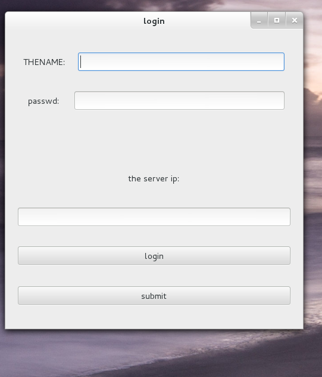
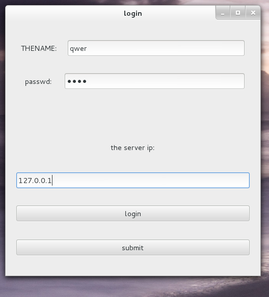
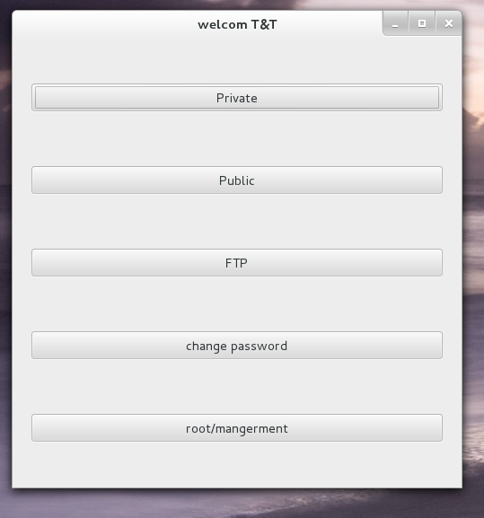
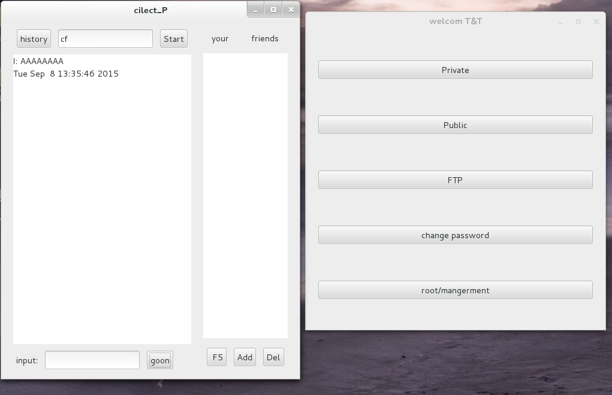
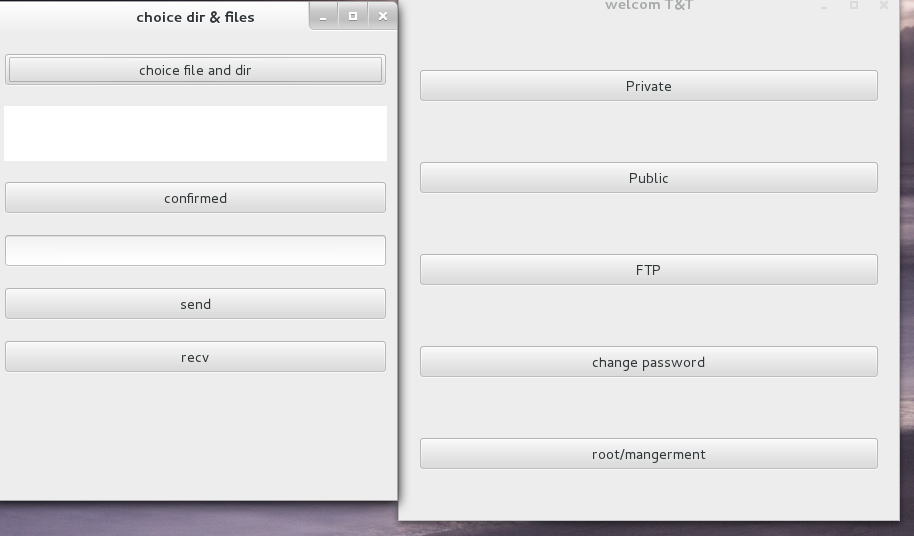
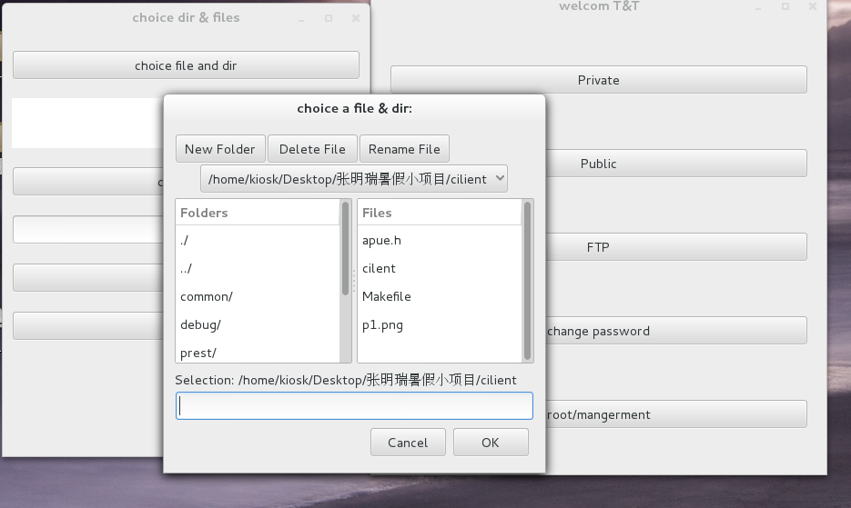
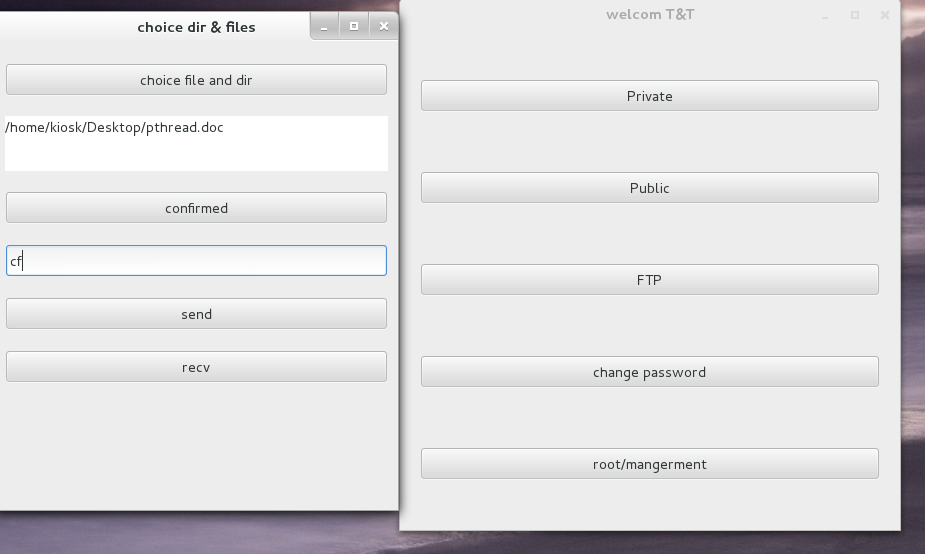
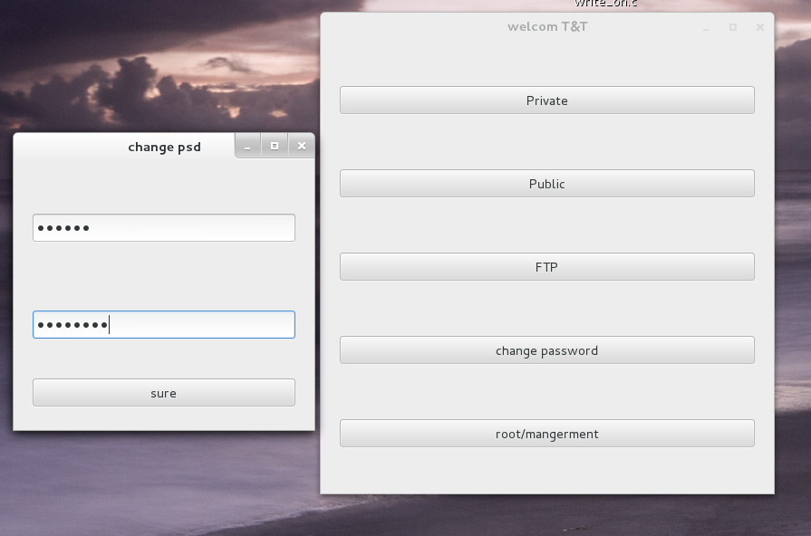
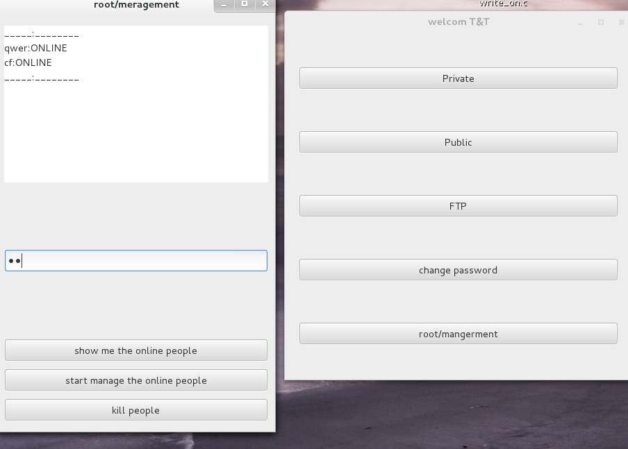

# Chat_Room
# Linux环境下基于GTK 的C/S聊天系统

## 项目综述

本项目是以Linux C 为主体，使用网络套接字编写，并且具有图形界面（GTK）的可视化聊天室软件。完整实现私人聊天与群组聊天，传文件，日志处理，离线消息，管理员管理功能，信息修改等功能。

## 开发平台与工具

  编辑器：vim  gedit
  
  编译器：gcc
  
  调试工具：gdb
  
  开发平台：fredoa 21 linux4.0.6-200.fc21.x86_64
  
## 核心模块思路综述

私聊模块：客户端发送信息时，需要发送IP/名称，然后发送信息到服务器端，通过服务器端根据IP/名称，确定其链接套接字，然后发送信息到对应的客户端。就是使用服务器作为中转站。将消息转发到对方的套接字中。

群聊模块：服务器每接收一条信息就将这条信息，发送给已经为人聊天状态的所有用户。
  
文件传送：类似于传送消息，FTP功能只有在处理文件传输功能的时候才会被开启，首先，当需要发送文件的时候，打开文件传输窗口，选择相关文件以及目标对象的名字，发送一个询问语句，等待对方接受。测试经过服务器的转发对方已经接受到了一个文件传送的消息或是显示于聊天窗口，或是显示在FTP 专用窗口，但是只有在FTP主窗口中点击RECV按钮，方可接受，这时服务器首先转发RECV 消息，当消息转发完成后，客户端接受到RECV 信息，确认文件名，开始传输文件，当文件传输完毕后发送一个传送完成的信号，其中如果文件大于800K，那就增加分片标识机制。进一步设计：首先发送端，点击发送按钮，此时立即发送一个基本的数据包，其中包括需要传送的文件，然后有一个读取语句，将后边的发送语句挂起等待一个条件变量，此时对方收发到了先遣数据包，当对方点击接受按钮时，首先会发送一个带有接受标识的数据包用来改变对方的条件变量随后开启接受线程等待最终文件接受完毕后，对方会发送一个文件已经传送完成信号，此时最后一个数据包被接受，跳出循环，线程终止。
                   
                                     
好友处理模块：添加一种新的消息包类型，用新的类型来标记好友相关信息：
其中好友处理函数又包含三个方面。刷新，添加，删除。这三个字函数，他们根据消息传第的不同内容作出三种响应，最终完成好友相关操作。其中，服务器首先接受一个添加好友的请求，然后将请求转发给目标用户，前提:目标在线，暂不考率目标离线情况（离线默认也可以添加，对方会收到一个被添加的离线消息）。然后由目标给与一个反馈信息，此时需求客户端并不是阻塞模式，可以正常收发信息。才用“发出后不管”的策略。其时每个客户端都在等待一个加它为好友的信息。待客户端成功得到结果后，就将反馈信息反馈给服务器，最终由服务器来完成加好友操作工作。
离线消息模块：
	对方发送一个消息，服务器判断目标是否在线，如果是离线就暂时存储在服务器端的目标文件中，对方上线后会首先读取这个文件以达到得到离线消息的目的。

	
##### 线程池技术应用：
	针对不同的客户端分配给它一个线程，这个线程调用work( )函数，work( ): 首先从服务器的存储用户信息的文件中读取所有用户信
	息进链表然后便利链表查找相应信息，如果没有发送错误信息并且关闭链接套接字，断开本次链接。如果查找成功，修改标志值，保持
	链接存在，创建发送，获取数据的两个线程，与客户端进行通信。上线后首先读取离线文件，如果文件里有东西就将文件内的离线消息
	打印出来接下来读取发送过来的信息确定是要私人聊天还是多人聊天，根据标识与IP等信息确定聊天状态,用户成功登录或者注册后，
	使用gtk,弹出一个窗口，让用户选择当前需要的聊天模式，私人聊天，多人聊天，以及文件发送总共三个模块，用户选择后则进入各自
	不同的界面，聊天模块都是相类似的两个界面，文件传输为一个单独的模块。    
关于服务器上文件的相应处理与使用，首先服务器存在一个服务器-客户文件（server)这个文件用来存储所有客户的信息其中包括用户名，密码，登录状态，套接字等，每次客户登录时首先刷新读取这个文件一遍，将其中信息读取到一个公共的链表上，其次改变自己的状态，与描述符，将这些信息改变后即刻写入文件中（应当使用读写锁），以便于下一个用户在登录后刷新读取链表时得到的是一个正确的链表信息。所以服务器在使用链表前都应当刷新读取文件进链表一边（或者在下线时在改变相关文件的时候，同时更改链表的信息,这种方法更有可行性）。

## 运行展示

#### 开始菜单
@登陆IP，没有可以申请。

@密码

@服务器IP 地址

@登陆按钮

@注册按钮

##### 登陆示例

#### 功能菜单

@私人聊天

@群组聊天

@文件传输

@修改信息

@管理员选项

#### 私人聊天功能

示例：向目标好友输入目标名称cf ,点击start按钮开始聊天，向他发送AAAA消息。

history 按钮显示历史聊天消息。

聊天面板打印用户聊天信息和时间。

右边是好友列表，提供增删改查好友功能。

#### 群组聊天

和私人聊天类似

#### 文件传输

______________________________________________________________

______________________________________________________________

#### 修改信息和管理员

修改密码，管理员可以看到所有在线的人，并且可以踢掉任意的人。

______________________________________________________________

